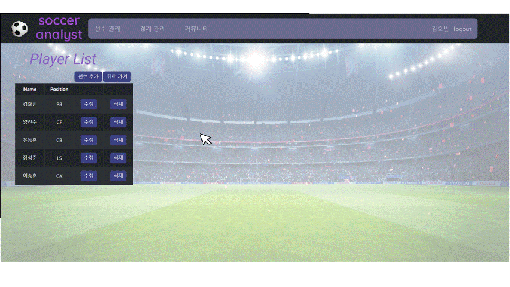
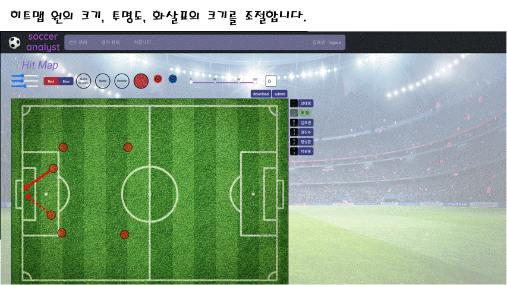
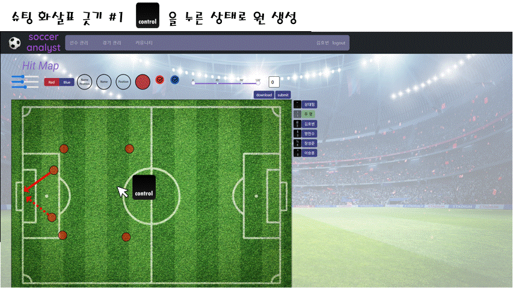
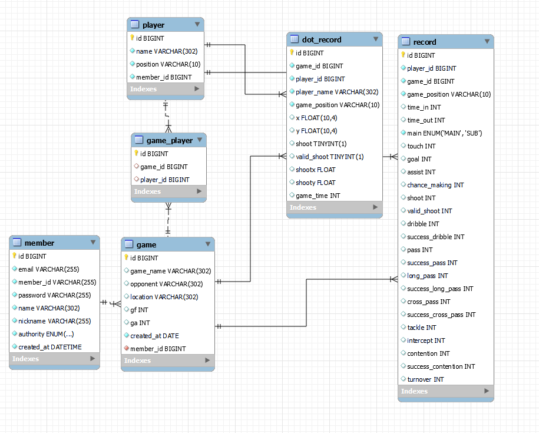

# SoccerAnalyst 개인 토이프로젝트입니다.

# 1. 개요

​지인의 부탁으로 Hitmap 을 작성하는 애플리케이션을 개발했습니다. (현재는 사용 x)

  \*Hitmap : 패스를 주거나 슛을 한 위치와 성공 여부를 기록한 맵

# 2. 실행

- front-end
  - `npm install`
  - `npm run start`
- back-end
  - redis 를 6379 포트에 실행 필요

# 2. 디자인 및 기능

|로그인 페이지|회원가입 페이지|
|------|---|
|||

|선수 관리 페이지|경기 관리 페이지|
|------|---|
|||

|히트맵 작성1|히트맵 작성2|
|------|---|
||>|

# 3. 사용 기술

- Frontend : react, js
- Backend : Spring Boot 3.0, Spring Data JPA, MySQL, AWS
- Dev : AWS

# 4. ERD

